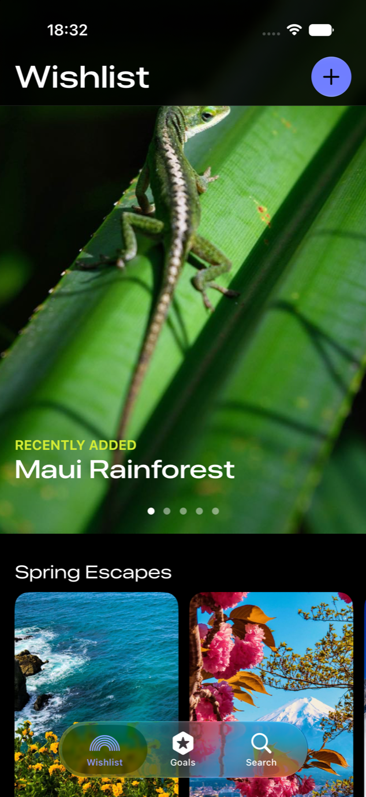
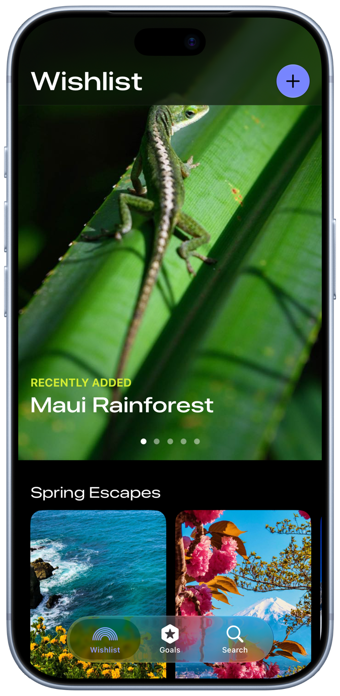

# Simulator Bezel

Automatically frame your iPhone Simulator screenshots with a device bezel, the moment they land on your Desktop.

iPhone 模擬器截圖存到桌面後,自動套上實機外框(bezel)。

| Simulator screenshot 模擬器截圖 | Auto-framed 自動加框後 |
|:---:|:---:|
|  |  |

**[English](#english)** | **[繁體中文](#繁體中文)**

---

## English

Save a screenshot in the iPhone Simulator (`Cmd+S`) and a framed `... Bezel.png` appears next to it on your Desktop within seconds — no clicks, no drag-and-drop, fully automatic.

### Requirements

- macOS (uses the built-in launchd; no third-party dependencies)
- Xcode or Command Line Tools, for compiling at install time (`xcode-select --install`)

### Install

```bash
git clone https://github.com/PeterPanSwift/simulator-bezel.git
cd simulator-bezel
./install.sh
```

Then press <kbd>Cmd</kbd>+<kbd>S</kbd> in the Simulator to save a screenshot to your Desktop and watch it get framed. If macOS asks for permission to access your Desktop on the first run, click Allow.

### How it works

- `install.sh` compiles `bezel-frame`, deploys it together with `bezel.png` to `~/Library/Application Support/add-bezel/`, and registers a launchd LaunchAgent (`~/Library/LaunchAgents/com.add-bezel.plist`).
- The LaunchAgent uses **WatchPaths** to watch `~/Desktop`: whenever the folder changes, the system launches `bezel-frame --scan` once. Idle cost is zero (kernel event notification, not polling), and a scan that finds nothing to do finishes in about 16 ms.
- `bezel-frame` auto-detects the transparent screen cutout in `bezel.png` (flood-filling transparent pixels from the center), draws the screenshot underneath and the bezel on top — so **swapping in a different bezel image requires no code changes**.
- Only files matching `Screenshot iPhone*.png` or `Simulator Screenshot*iPhone*.png` are processed; files that already have a `... Bezel.png` counterpart are skipped (idempotent — rescanning never redoes work).

### Custom bezel

Replace `bezel.png` with any frame image whose **screen area is transparent**, then run `./install.sh` again. The cutout position and size are detected at runtime.

The bundled `bezel.png` is an iPhone 17 Pro (Cosmic Orange) with a 1206×2622 screen cutout — a 1:1 match for Simulator screenshot resolution.

### Manual run

```bash
./add-bezel.sh            # scan ~/Desktop
./add-bezel.sh ~/Pictures # scan a specific folder
```

Or frame a single file:

```bash
./bezel-frame bezel.png screenshot.png output.png
```

### Troubleshooting

- Execution log: `~/Library/Caches/add-bezel.log` — one line per scan (`visible=` screenshots seen, `framed=` newly framed).
- If nothing happens, check the LaunchAgent: `launchctl print gui/$(id -u)/com.add-bezel`.

### Uninstall

```bash
./uninstall.sh
```

Framed images on your Desktop are left untouched.

---

## 繁體中文

iPhone 模擬器的截圖存到桌面後,**自動**套上實機外框(bezel),產生適合分享、放簡報的圖片。

存下 `Screenshot iPhone 17 Pro ... .png` 幾秒後,旁邊就會自動出現加好外框的 `Screenshot iPhone 17 Pro ... Bezel.png`,完全不用動手。

### 需求

- macOS(使用內建的 launchd,不需安裝任何第三方工具)
- Xcode 或 Command Line Tools(安裝時編譯用:`xcode-select --install`)

### 安裝

```bash
git clone https://github.com/PeterPanSwift/simulator-bezel.git
cd simulator-bezel
./install.sh
```

安裝後在模擬器按 <kbd>Cmd</kbd>+<kbd>S</kbd> 存一張截圖到桌面試試。第一次執行時若 macOS 詢問是否允許取用「桌面」,請按允許。

### 運作原理

- `install.sh` 會把編譯好的 `bezel-frame` 和 `bezel.png` 部署到 `~/Library/Application Support/add-bezel/`,並註冊一個 launchd LaunchAgent(`~/Library/LaunchAgents/com.add-bezel.plist`)。
- LaunchAgent 用 **WatchPaths** 監看 `~/Desktop`:桌面一有變動,系統就喚起 `bezel-frame --scan` 掃描一次。平常完全不耗資源(核心事件通知,不是輪詢),沒有新截圖時一次掃描約 16 毫秒就結束。
- `bezel-frame` 會自動偵測 `bezel.png` 透明螢幕開口的位置(從中心 flood-fill 透明像素),把截圖墊在下層、外框疊在上層合成,所以**換不同外框圖不需要改任何程式**。
- 檔名符合 `Screenshot iPhone*.png` 或 `Simulator Screenshot*iPhone*.png` 的檔案才會處理;已經有對應 `... Bezel.png` 的會跳過(冪等,重複掃描不會重做)。

### 自訂外框

把 `bezel.png` 換成任何**螢幕區域為透明**的外框圖,重新執行 `./install.sh` 即可。開口位置與大小都是執行時自動偵測的。

附的 `bezel.png` 是 iPhone 17 Pro(宇宙橙),螢幕開口 1206×2622,和模擬器截圖解析度 1:1 對應。

### 手動執行

```bash
./add-bezel.sh            # 掃描 ~/Desktop
./add-bezel.sh ~/Pictures # 掃描指定資料夾
```

或單張合成:

```bash
./bezel-frame bezel.png 截圖.png 輸出.png
```

### 疑難排解

- 執行記錄:`~/Library/Caches/add-bezel.log`,每次掃描都會留一行(`visible=看到幾張截圖 framed=這次加框幾張`)。
- 若一直沒反應,檢查 LaunchAgent 狀態:`launchctl print gui/$(id -u)/com.add-bezel`。

### 解除安裝

```bash
./uninstall.sh
```

已加框的圖片不會被刪除。

## License

MIT
